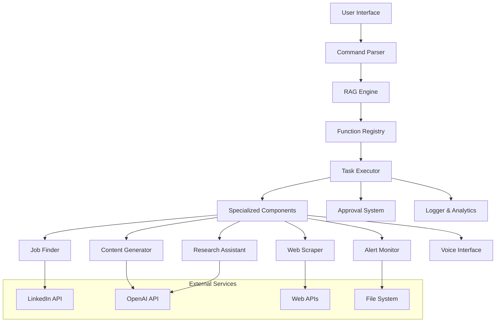

# Design Document

## Overview

The LLM-RAG Automation System will be transformed from a basic function execution system into a comprehensive automation platform. The system will maintain the existing RAG-based function retrieval while adding advanced capabilities for web scraping, job searching, content generation, research automation, monitoring, and voice interaction.

## Architecture

### High-Level Architecture



### Core Components Enhancement

1. **Enhanced RAG Engine**: Expand function metadata and improve retrieval accuracy
2. **Modular Task Executor**: Support for complex workflows and function chaining
3. **Specialized Service Layer**: Dedicated components for each major feature area
4. **Security Layer**: Approval system and sandboxed execution
5. **Monitoring Layer**: Real-time alerts and system monitoring

## Components and Interfaces

### 1. Enhanced Command Parser

```python
class CommandParser:
    def parse_command(self, command: str) -> CommandIntent
    def extract_parameters(self, command: str, intent: CommandIntent) -> Dict
    def validate_command(self, command: str) -> bool
```

**Responsibilities:**
- Natural language understanding
- Parameter extraction
- Command validation
- Intent classification

### 2. Advanced RAG Engine

```python
class AdvancedRAGEngine:
    def retrieve_function(self, command: str, context: Dict) -> FunctionMatch
    def get_function_chain(self, command: str) -> List[FunctionMatch]
    def update_embeddings(self, new_functions: List[Function]) -> None
```

**Enhancements:**
- Support for multi-step function chains
- Context-aware retrieval
- Dynamic function registration
- Improved embedding model

### 3. Web Scraping Service

```python
class WebScrapingService:
    def scrape_website(self, url: str, selectors: Dict) -> ScrapedData
    def bulk_scrape(self, urls: List[str], config: ScrapeConfig) -> List[ScrapedData]
    def download_media(self, urls: List[str], media_type: str) -> DownloadResult
    def extract_links(self, url: str, filter_criteria: Dict) -> List[str]
```

**Features:**
- Selenium-based dynamic content scraping
- Bulk operations with progress tracking
- Media download capabilities
- Rate limiting and proxy support

### 4. LinkedIn Job Finder

```python
class LinkedInJobFinder:
    def search_jobs(self, criteria: JobSearchCriteria) -> List[JobListing]
    def extract_job_details(self, job_url: str) -> JobDetails
    def save_to_csv(self, jobs: List[JobListing], filename: str) -> None
    def filter_jobs(self, jobs: List[JobListing], filters: Dict) -> List[JobListing]
```

**Features:**
- LinkedIn API integration
- Advanced filtering capabilities
- CSV export functionality
- Job alert subscriptions

### 5. AI Content Generator

```python
class ContentGenerator:
    def generate_social_posts(self, topic: str, count: int, platform: str) -> List[str]
    def generate_emails(self, purpose: str, tone: str, count: int) -> List[str]
    def schedule_content(self, content: List[str], schedule: Schedule) -> None
    def generate_variations(self, base_content: str, count: int) -> List[str]
```

**Features:**
- OpenAI GPT integration
- Platform-specific content optimization
- Scheduling capabilities
- A/B testing support

### 6. Research Assistant

```python
class ResearchAssistant:
    def search_papers(self, query: str, sources: List[str]) -> List[Paper]
    def summarize_papers(self, papers: List[Paper]) -> Summary
    def generate_report(self, summaries: List[Summary], format: str) -> Report
    def extract_citations(self, papers: List[Paper]) -> List[Citation]
```

**Features:**
- Academic database integration
- AI-powered summarization
- Citation management
- Multi-format report generation

### 7. Alert Monitoring System

```python
class AlertMonitor:
    def create_monitor(self, condition: MonitorCondition) -> Monitor
    def check_conditions(self) -> List[Alert]
    def send_notification(self, alert: Alert, method: str) -> None
    def get_monitor_history(self, monitor_id: str) -> List[MonitorEvent]
```

**Features:**
- Continuous background monitoring
- Multiple notification channels
- Historical data tracking
- Customizable alert conditions

### 8. Voice Interface

```python
class VoiceInterface:
    def speech_to_text(self, audio: AudioData) -> str
    def text_to_speech(self, text: str) -> AudioData
    def process_voice_command(self, audio: AudioData) -> CommandResult
    def configure_voice_settings(self, settings: VoiceSettings) -> None
```

**Features:**
- Multi-language support
- Noise cancellation
- Voice authentication
- Continuous listening mode

### 9. Approval System

```python
class ApprovalSystem:
    def require_approval(self, code: str, risk_level: RiskLevel) -> ApprovalRequest
    def get_user_approval(self, request: ApprovalRequest) -> ApprovalResponse
    def execute_with_approval(self, code: str, context: Dict) -> ExecutionResult
    def audit_log(self, action: str, user: str, approved: bool) -> None
```

**Features:**
- Risk assessment
- Code review interface
- Audit logging
- Configurable approval levels

## Data Models

### Core Models

```python
@dataclass
class CommandIntent:
    action: str
    parameters: Dict[str, Any]
    confidence: float
    requires_approval: bool

@dataclass
class FunctionMatch:
    function_name: str
    confidence: float
    parameters: Dict[str, Any]
    estimated_execution_time: int

@dataclass
class ExecutionResult:
    success: bool
    output: Any
    execution_time: float
    logs: List[str]
    generated_code: str

@dataclass
class JobListing:
    title: str
    company: str
    location: str
    description: str
    requirements: List[str]
    salary_range: Optional[str]
    posted_date: datetime
    url: str

@dataclass
class ScrapedData:
    url: str
    content: Dict[str, Any]
    media_urls: List[str]
    timestamp: datetime
    success: bool

@dataclass
class MonitorCondition:
    type: str  # price, stock, website_change, system_metric
    target: str
    condition: str  # <, >, ==, contains, etc.
    threshold: Any
    check_interval: int
```

## Error Handling

### Error Categories

1. **Network Errors**: Timeout, connection failures, rate limiting
2. **Authentication Errors**: API key issues, login failures
3. **Parsing Errors**: Invalid command syntax, missing parameters
4. **Execution Errors**: Function failures, permission issues
5. **Resource Errors**: Insufficient memory, disk space, CPU

### Error Handling Strategy

```python
class ErrorHandler:
    def handle_network_error(self, error: NetworkError) -> RetryStrategy
    def handle_auth_error(self, error: AuthError) -> AuthRecovery
    def handle_parsing_error(self, error: ParseError) -> UserGuidance
    def handle_execution_error(self, error: ExecutionError) -> Fallback
    def log_error(self, error: Exception, context: Dict) -> None
```

**Recovery Mechanisms:**
- Automatic retry with exponential backoff
- Fallback to alternative methods
- User notification with suggested actions
- Graceful degradation of functionality

## Testing Strategy

### Unit Testing
- Individual component testing
- Mock external dependencies
- Edge case validation
- Performance benchmarking

### Integration Testing
- End-to-end workflow testing
- API integration validation
- Database interaction testing
- External service integration

### Security Testing
- Code injection prevention
- API security validation
- User input sanitization
- Permission boundary testing

### Performance Testing
- Load testing for concurrent users
- Memory usage optimization
- Response time benchmarking
- Scalability assessment

## Security Considerations

### Code Execution Security
- Sandboxed execution environment
- Whitelist of allowed operations
- User approval for high-risk operations
- Audit logging for all executions

### Data Protection
- Encrypted storage of sensitive data
- Secure API key management
- User data anonymization
- GDPR compliance measures

### Network Security
- Rate limiting implementation
- Proxy rotation for web scraping
- SSL/TLS for all communications
- Input validation and sanitization

## Deployment Architecture

### Development Environment
- Local FastAPI server
- SQLite database for development
- Mock external services
- Hot reload for rapid development

### Production Environment
- Docker containerization
- PostgreSQL database
- Redis for caching and queues
- Load balancer for scalability
- Monitoring and logging infrastructure

### Configuration Management
- Environment-based configuration
- Secure secret management
- Feature flags for gradual rollout
- A/B testing infrastructure